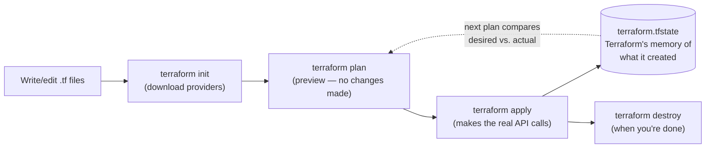

# 01 — Terraform Fundamentals

> Introduction to Infrastructure as Code · Introduction to Terraform and setup ·
> Terraform architecture and workflow · your first EC2 instance with Terraform.

## 1. Why Infrastructure as Code

Every prior part of this course (`three-tier-deployment`) provisioned AWS with
**shell scripts calling the AWS CLI** — `infra/01-ec2.sh`, `infra/40-vpc.sh`,
and so on. Those scripts work, but they're **imperative**: each line is a
step ("create this, then create that, then wait, then tag it"). To know what
infrastructure actually exists, you have to either re-read every script in
order, or go look in the AWS Console.

**Infrastructure as Code (IaC)** flips this: you write a file that describes
the **end state** you want, and a tool figures out the steps to get there —
and, just as importantly, **what already matches** so it doesn't redo work,
and **how to undo it cleanly**. Terraform is one such tool (others: AWS
CloudFormation/CDK, Pulumi — Terraform's advantage is being cloud-agnostic:
the same tool and language work for AWS, Azure, GCP, and 1000+ other
providers).

| Pain point without IaC | How Terraform solves it |
|---|---|
| Manual console clicks — slow, easy to fat-finger | Declare resources once in code, apply in seconds |
| "It worked when I ran it" — not reproducible | The same `.tf` files produce identical infrastructure every time |
| No record of what changed or why | Changes live in Git — full history and blame |
| Tearing down is easy to forget (costs money) | `terraform destroy` removes everything the config created |
| A script can't tell you what it *would* do first | `terraform plan` previews every change before touching anything |

That last row is the single biggest practical difference from
`three-tier-deployment`'s shell scripts. A script just runs. Terraform's
**plan** step is a dry run you read *before* deciding to apply — the closest
thing to a compiler error message for infrastructure changes.

---

## 2. Installing Terraform

```console
$ terraform version
Terraform v1.14.6
on windows_amd64
```

If you don't have it: <https://developer.hashicorp.com/terraform/install>.
This course pins `required_version = ">= 1.5.0"` in every lesson (see
`versions.tf`) — new enough for every feature used here, loose enough not to
force a specific patch release.

You also need the AWS CLI already configured with the `ostad` profile — the
exact same one every part of `three-tier-deployment` used:

```console
$ aws sts get-caller-identity --profile ostad
{
    "UserId": "...",
    "Account": "738928894806",
    "Arn": "arn:aws:iam::738928894806:user/tonmoy.ashik@gmail.com"
}
```

If that fails, run `aws configure --profile ostad` first — Terraform will
hit the exact same wall.

---

## 3. Terraform's Architecture and Workflow

Four files make up this lesson, and the pattern repeats in every lesson
after it:

| File | Job |
|---|---|
| `versions.tf` | Which Terraform version and which **providers** (plugins that talk to a specific API — here, AWS) this config needs |
| `provider.tf` | Configures the AWS provider: which region, which credentials (`profile`) |
| `variables.tf` | Declares **inputs** — named, typed, with optional defaults |
| `main.tf` | The actual resources (and **data sources** — see below) |
| `outputs.tf` | **Return values**, readable after apply with `terraform output` |

The workflow, every time:



- **`init`** downloads the provider plugin (here, `hashicorp/aws`) and
  records the exact version in `.terraform.lock.hcl` — **commit this file**,
  so every clone of this repo resolves the identical provider version.
- **`plan`** makes ZERO changes to AWS. It reads current state, compares to
  your `.tf` files, and prints exactly what would change — `+` create,
  `~` update in place, `-/+` destroy-and-recreate, `-` destroy.
- **`apply`** makes the real API calls, then writes the result into
  **`terraform.tfstate`** — a JSON file that is Terraform's only memory of
  what it created. Lose this file (without a remote backend, see lesson 04)
  and Terraform no longer knows these resources are "its."
- **`destroy`** reads the state file and deletes everything in it, in
  dependency order.

---

## 4. Your First EC2 Instance

Look at [`main.tf`](main.tf). Two blocks:

```hcl
data "aws_ami" "ubuntu" {
  most_recent = true
  owners      = ["099720109477"]  # Canonical
  filter {
    name   = "name"
    values = ["ubuntu/images/hvm-ssd-gp3/ubuntu-noble-24.04-amd64-server-*"]
  }
}

resource "aws_instance" "first" {
  ami           = data.aws_ami.ubuntu.id
  instance_type = var.instance_type
}
```

A **`data` source** reads something that already exists — it creates
nothing. `data.aws_ami.ubuntu` asks AWS "what's the newest Ubuntu 24.04 AMI
Canonical has published?" every time you plan, so the AMI ID is never
hardcoded and never goes stale — the exact same problem
`three-tier-deployment/infra/01-ec2.sh`'s `describe-images` call solved with
a shell one-liner; here it's one `data` block instead.

A **`resource`** block is something Terraform will create/change/destroy.
`aws_instance.first` is deliberately bare — no security group — because
this lesson is about the *workflow*, not connectivity (that starts in
lesson 07).

### Run it

```bash
cd 01-terraform-fundamentals
terraform init
terraform plan
terraform apply
```

Real output from this exact config:

```console
$ terraform init
Initializing the backend...
Initializing provider plugins...
- Finding hashicorp/aws versions matching "~> 5.0"...
- Installing hashicorp/aws v5.100.0...
Terraform has been successfully initialized!

$ terraform plan
data.aws_ami.ubuntu: Reading...
data.aws_ami.ubuntu: Read complete after 1s [id=ami-0ba4172b23e57d5a8]
Plan: 1 to add, 0 to change, 0 to destroy.

$ terraform apply -auto-approve
aws_instance.first: Creating...
aws_instance.first: Still creating... [00m10s elapsed]
aws_instance.first: Creation complete after 14s [id=i-0c8b0f74fa92b054b]

Apply complete! Resources: 1 added, 0 changed, 0 destroyed.

Outputs:
ami_id_used = "ami-0ba4172b23e57d5a8"
instance_id = "i-0c8b0f74fa92b054b"
instance_state = "running"
```

Verify it independently, the same way every `three-tier-deployment` script
did:

```console
$ aws ec2 describe-instances --profile ostad --instance-ids i-0c8b0f74fa92b054b \
    --query 'Reservations[0].Instances[0].[InstanceId,State.Name,InstanceType]' --output text
i-0c8b0f74fa92b054b     running    t3.micro
```

And ask Terraform itself what it's tracking:

```console
$ terraform state list
data.aws_ami.ubuntu
aws_instance.first
```

### Clean up

```console
$ terraform destroy -auto-approve
aws_instance.first: Destroying... [id=i-0c8b0f74fa92b054b]
aws_instance.first: Still destroying... [id=i-0c8b0f74fa92b054b, 00m20s elapsed]
aws_instance.first: Destruction complete after 31s

Destroy complete! Resources: 1 destroyed.
```

**Always `terraform destroy` at the end of a lesson** — a stray `t3.micro`
is cheap (~US$0.01/hr) but there's no reason to pay for it once you've
proven the point.

## If it breaks

- `Error: no matching AMI found` — Canonical occasionally reorganizes AMI
  naming; check `aws ec2 describe-images --owners 099720109477 --filters
  "Name=name,Values=ubuntu/images/hvm-ssd-gp3/ubuntu-noble-24.04-*"` to
  confirm the pattern still matches something.
- `Error: error configuring Terraform AWS Provider: ... profile ostad ...` —
  run `aws sts get-caller-identity --profile ostad`; if that fails,
  `aws configure --profile ostad` first.

## Next

**[02 — Writing Terraform with GitHub Copilot](../02-github-copilot-for-terraform/)**
