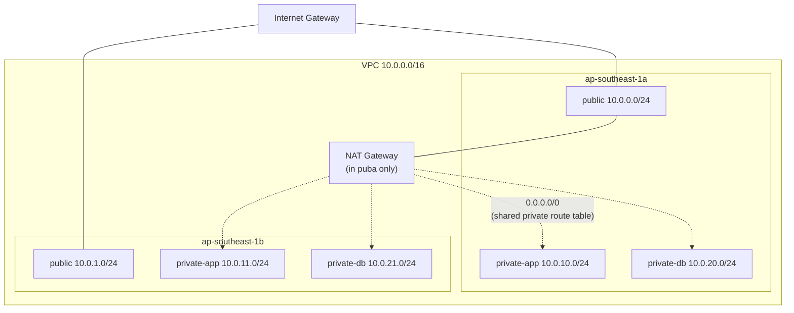

# 06 — VPC Networking (Class 8 begins)

> Recreating the exact custom VPC `three-tier-deployment`'s Part 5/6 built
> by hand with AWS CLI shell scripts — 6 subnets across 2 AZs, one Internet
> Gateway, one NAT Gateway, all as Terraform resources instead of a bash
> loop.

## 1. Same architecture, different tool

This is a direct port of `three-tier-deployment/infra/40-vpc.sh` +
`41-nat-gateway.sh` — same CIDR layout, same reasoning, same cost
trade-offs. Nothing about the *architecture* changes; what changes is that
this repo's [`modules/vpc/`](modules/vpc/) describes the end state once,
and Terraform figures out create order (and, more importantly, destroy
order — try untangling a VPC teardown by hand and you'll want this).



- **6 subnets, 2 AZs, 3 tiers** — public (ALB/bastion, lessons 09/10),
  private-app (frontend/backend, lesson 08), private-db (RDS's own subnet
  group, lesson 08).
- **One NAT Gateway, not two** — placed in the AZ-a public subnet only,
  and a single private route table shared by *all four* private subnets
  routes `0.0.0.0/0` through it. The same trade-off Part 5/6 made
  explicitly: half the NAT Gateway cost, at the cost of both AZs losing
  egress together if that specific AZ has an outage — acceptable for a lab,
  not something you'd necessarily choose for production.
- `data "aws_availability_zones"` (not hardcoded `ap-southeast-1a`/`1b`)
  picks whichever two AZs AWS reports available in this account/region —
  the same reason lesson 01's AMI lookup uses a `data` source instead of a
  hardcoded ID.

## 2. Run it

```bash
cd 06-vpc-networking
cp backend.hcl.example backend.hcl   # same bootstrap bucket/table as lesson 04
terraform init -backend-config=backend.hcl
terraform apply
```

Real output:

```console
$ terraform apply -auto-approve
module.vpc.aws_nat_gateway.this: Creation complete after 1m55s [id=nat-02aba5894c6d98b70]
module.vpc.aws_route.private_nat: Creation complete after 1s

Apply complete! Resources: 20 added, 0 changed, 0 destroyed.

Outputs:
availability_zones = ["ap-southeast-1a", "ap-southeast-1b"]
nat_gateway_id = "nat-02aba5894c6d98b70"
private_app_subnet_ids = ["subnet-0398291ace2af789a", "subnet-072303314772beac1"]
private_db_subnet_ids = ["subnet-04b8b79db91c1c065", "subnet-0c5bc3eafe2bc8d17"]
public_subnet_ids = ["subnet-0c2cd9f0a1e8376dd", "subnet-085b163749e209773"]
vpc_id = "vpc-05e372d669bcec8d3"
```

The NAT Gateway alone takes ~2 minutes to provision — normal, not a hang.

Cross-checked independently with the AWS CLI, the same standard every part
of `three-tier-deployment` used:

```console
$ aws ec2 describe-subnets --profile ostad --filters "Name=vpc-id,Values=vpc-05e372d669bcec8d3" \
    --query 'Subnets[].[SubnetId,CidrBlock,AvailabilityZone,MapPublicIpOnLaunch,Tags[?Key==`Tier`]|[0].Value]' \
    --output table
-----------------------------------------------------------------------------------------
|  subnet-0398291ace2af789a |  10.0.10.0/24 |  ap-southeast-1a |  False |  private-app  |
|  subnet-0c5bc3eafe2bc8d17 |  10.0.21.0/24 |  ap-southeast-1b |  False |  private-db   |
|  subnet-04b8b79db91c1c065 |  10.0.20.0/24 |  ap-southeast-1a |  False |  private-db   |
|  subnet-072303314772beac1 |  10.0.11.0/24 |  ap-southeast-1b |  False |  private-app  |
|  subnet-085b163749e209773 |  10.0.1.0/24  |  ap-southeast-1b |  True  |  public       |
|  subnet-0c2cd9f0a1e8376dd |  10.0.0.0/24  |  ap-southeast-1a |  True  |  public       |
-----------------------------------------------------------------------------------------

$ aws ec2 describe-nat-gateways --profile ostad --nat-gateway-ids nat-02aba5894c6d98b70 --query 'NatGateways[0].State' --output text
available

$ aws ec2 describe-route-tables --profile ostad --filters "Name=vpc-id,Values=vpc-05e372d669bcec8d3" \
    --query 'RouteTables[].[RouteTableId,Routes[].[DestinationCidrBlock,GatewayId,NatGatewayId]]'
[
  ["rtb-...", [["10.0.0.0/16","local",null]]],                                   # main (unassociated)
  ["rtb-...", [["10.0.0.0/16","local",null], ["0.0.0.0/0","igw-...",null]]],      # public
  ["rtb-...", [["10.0.0.0/16","local",null], ["0.0.0.0/0",null,"nat-..."]]]       # private (shared)
]
```

Exactly as designed: 6 subnets split correctly across 2 AZs and 3 tiers,
only the public subnets have `MapPublicIpOnLaunch=true`, the public route
table points at the Internet Gateway, and the one private route table
points at the one NAT Gateway.

### Clean up

```console
$ terraform destroy -auto-approve
module.vpc.aws_nat_gateway.this: Destruction complete after 1m1s
Destroy complete! Resources: 20 destroyed.
```

NAT Gateway teardown is the slow step here too (~1 minute) — Terraform
waits for AWS to confirm it before proceeding, the same wait
`teardown-vpc.sh` had in `three-tier-deployment`.

## If it breaks

- `Error: InvalidParameterValue: Invalid availability zone` — extremely
  unlikely with `data "aws_availability_zones"`, but if your account has
  fewer than 2 AZs enabled in this region, opt in via the AWS Console
  (Account → Zones).
- NAT Gateway stuck `pending` for more than ~5 minutes — check the AWS
  Health Dashboard for `ap-southeast-1` service issues; this is an AWS-side
  wait, not something Terraform config controls.

## Next

**[07 — Security Groups as Code](../07-security-groups-as-code/)**
