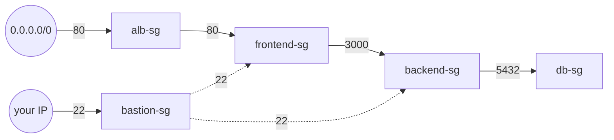

# 07 — Security Groups as Code

> The exact chained security-group model `three-tier-deployment`'s Part 6
> built with `infra/42-security-groups.sh` — ALB → frontend → backend → db,
> each tier reachable only from the one immediately in front of it — this
> time with Terraform handling create *and* destroy order automatically.

## 1. The chain



Five groups, defined in [`modules/security-group/main.tf`](modules/security-group/main.tf):

| Group | Allows in | From |
|---|---|---|
| `alb-sg` | 80 | anywhere (`0.0.0.0/0`) — the one deliberately public rule |
| `bastion-sg` | 22 | your IP only (`var.my_ip_cidr`) |
| `frontend-sg` | 80 | `alb-sg` |
| `frontend-sg` | 22 | `bastion-sg` |
| `backend-sg` | 3000 | `frontend-sg` |
| `backend-sg` | 22 | `bastion-sg` |
| `db-sg` | 5432 | `backend-sg` |

Not one `cidr_blocks` entry anywhere in this chain except the two
deliberate edges (the ALB's public 80, the bastion's one-IP 22). Every
other rule references another security group by ID
(`security_groups = [aws_security_group.alb.id]`, etc.) — the source is
"whatever's in that group," not an IP range, so it stays correct even as
instances are replaced.

The bastion group is defined here even though the bastion host itself
isn't created until lesson 10 — this lesson's job is the whole chain, and
`frontend-sg`/`backend-sg` need to reference `bastion-sg`'s ID regardless
of whether an instance is using it yet.

## 2. Why this chain doesn't hit the destroy-order bug from Part 6

`three-tier-deployment`'s `teardown-vpc.sh` had to special-case its SG
teardown: `frontend-sg` and `backend-sg` referenced *each other* (bidirectional traffic rules), so deleting either one first failed with
`DependencyViolation` — fixed there by revoking every ingress rule on all
four groups *before* deleting any of them.

This chain is intentionally **strictly linear** — `db` depends on
`backend`, which depends on `frontend`, which depends on `alb`/`bastion`,
and nothing points backward. Terraform's dependency graph sees that
automatically from the `security_groups = [...]` references and destroys
in the correct reverse order on its own:

```console
$ terraform destroy -auto-approve
module.sg.aws_security_group.db: Destroying...
module.sg.aws_security_group.db: Destruction complete after 1s
module.sg.aws_security_group.backend: Destroying...
module.sg.aws_security_group.backend: Destruction complete after 1s
module.sg.aws_security_group.frontend: Destroying...
module.sg.aws_security_group.frontend: Destruction complete after 1s
module.sg.aws_security_group.alb: Destroying...
module.sg.aws_security_group.bastion: Destroying...

Destroy complete! Resources: 5 destroyed.
```

**Update from lesson 10**: `modules/security-group`'s `vpc_id` variable used
to default to `null` and fall back to a `count`-guarded `data "aws_vpc"
"default"` lookup *inside the module* when unset. That works fine here,
where `vpc_id` is always the literal `null` you see below — but lesson 10
passes a real custom VPC's ID (`module.vpc.vpc_id`), a value not known
until apply, and `count` can't depend on that. Terraform refused with
`Invalid count argument`. The fix: `vpc_id` is now a required input with no
module-side fallback, and *this* lesson does its own default-VPC lookup in
[`main.tf`](main.tf) instead:

```hcl
data "aws_vpc" "default" {
  default = true
}

module "sg" {
  source     = "./modules/security-group"
  vpc_id     = data.aws_vpc.default.id
  my_ip_cidr = var.my_ip_cidr
}
```

Behavior here is identical either way — re-validated after the change
(`terraform plan` still shows the same 5 resources to add) — the
difference only matters for a caller passing a not-yet-known VPC ID, which
lesson 10 is the first lesson to do.

No revoke-first workaround needed — the same problem, solved by the tool
itself once the resource graph is expressed declaratively instead of as an
imperative script. (If a future lesson ever needs a genuine *circular*
reference between two groups, the same `DependencyViolation` would still
occur — Terraform doesn't invent a workaround for an actual cycle, it can
only order a graph that doesn't have one.)

## 3. Run it

```bash
cd 07-security-groups-as-code
cp terraform.tfvars.example terraform.tfvars
# edit terraform.tfvars: my_ip_cidr from curl -s https://checkip.amazonaws.com
cp backend.hcl.example backend.hcl
terraform init -backend-config=backend.hcl
terraform apply
```

Real output:

```console
$ terraform apply -auto-approve
module.sg.aws_security_group.alb: Creation complete after 3s [id=sg-058ad31c9c5bcc926]
module.sg.aws_security_group.bastion: Creation complete after 3s [id=sg-0a20b5518cf07f41c]
module.sg.aws_security_group.frontend: Creation complete after 3s [id=sg-041df7e5fddf04fa6]
module.sg.aws_security_group.backend: Creation complete after 3s [id=sg-024c933d295f4dd7d]
module.sg.aws_security_group.db: Creation complete after 3s [id=sg-0b42ea4d09d94a045]

Apply complete! Resources: 5 added, 0 changed, 0 destroyed.
```

Cross-checked with the AWS CLI that the rules really do reference the
right *group IDs*, not just look right in the plan:

```console
$ aws ec2 describe-security-groups --profile ostad --group-ids sg-024c933d295f4dd7d \
    --query 'SecurityGroups[0].IpPermissions[].[FromPort,ToPort,UserIdGroupPairs[0].GroupId]' --output text
22      22      sg-0a20b5518cf07f41c    # bastion
3000    3000    sg-041df7e5fddf04fa6    # frontend

$ aws ec2 describe-security-groups --profile ostad --group-ids sg-0b42ea4d09d94a045 \
    --query 'SecurityGroups[0].IpPermissions[].[FromPort,ToPort,UserIdGroupPairs[0].GroupId]' --output text
5432    5432    sg-024c933d295f4dd7d    # backend
```

`backend-sg` accepts 3000 from `frontend-sg`'s ID and 22 from
`bastion-sg`'s ID; `db-sg` accepts 5432 from `backend-sg`'s ID only —
exactly the chain in §1, confirmed against real AWS state, not just the
Terraform plan.

### Clean up

```console
$ terraform destroy -auto-approve
Destroy complete! Resources: 5 destroyed.
```

## If it breaks

- `Error: No value for required variable "my_ip_cidr"` — copy
  `terraform.tfvars.example` and fill in your real IP.
- `DependencyViolation` on destroy — something outside this lesson
  (an EC2 instance from a different, still-running lesson) is using one of
  these groups. Destroy that lesson first.

## Next

**[08 — Three-Tier Deployment](../08-three-tier-deployment/)**
