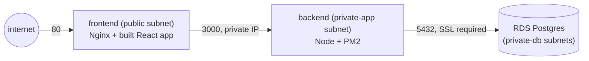

# 08 — Three-Tier Deployment

> The full stack from lesson 05, now spread across the custom VPC from
> lesson 06 — frontend and backend on separate instances, Postgres replaced
> by RDS. This is the exact architecture `three-tier-deployment`'s Part 5
> built by hand: frontend still public (lesson 09 puts it behind an ALB and
> makes it private, matching Part 6).

## 1. What moved, compared to lesson 05

| | Lesson 05 | This lesson |
|---|---|---|
| Instances | 1 (everything on one box) | 2 — frontend (public subnet) + backend (private-app subnet) |
| Database | Self-managed Postgres, same box | RDS, private-db subnet, `publicly_accessible = false` |
| Network | Default VPC | Lesson 06's custom VPC — frontend↔backend traffic crosses the private network, backend↔RDS too |
| SSL to DB | None (`PGSSL` unset) | Required — RDS enforces SSL by default |
| Frontend → Backend | `localhost:3000` | Backend's **private IP**, injected into Nginx's config by Terraform |



## 2. Two `user_data` scripts, one per tier

[`user_data_frontend.sh.tpl`](user_data_frontend.sh.tpl) installs Nginx,
downloads the built frontend from S3, and proxies `/api/` to
`${backend_private_ip}:3000` — a value Terraform only knows *after* the
backend instance exists, so `main.tf`'s reference
(`module.backend.private_ip`) forces the backend to be created first, no
explicit `depends_on` needed.

[`user_data_backend.sh.tpl`](user_data_backend.sh.tpl) has no Nginx at
all — just Node/PM2, fetches the DB password from Secrets Manager (same
pattern as lesson 05), and runs the migration against **RDS's endpoint**
instead of `localhost`.

## 3. Two real bugs found running this live

### Bug: `?sslmode=require` in `DATABASE_URL` broke the connection

RDS enforces SSL. `backend/src/db.js` already handles this — a `PGSSL=true`
env var switches on `ssl: { rejectUnauthorized: false }` in the `pg` Pool
config, deliberately *not* validating RDS's certificate chain (fine for a
lab; production would verify against RDS's real CA bundle instead). The
first version of this lesson's `user_data_backend.sh.tpl` also appended
`?sslmode=require` to `DATABASE_URL` "for clarity" — redundant, and it
broke things:

```console
$ curl http://<frontend-ip>/api/v1/history
{"error":true,"reason":"self-signed certificate in certificate chain"}
```

`/api/v1/forecast` still returned data (its own DB write is
best-effort/non-fatal — see `server.js`), which is exactly why only
`/api/v1/history` surfaced the failure directly. `pg`'s connection-string
parser reads `sslmode=require` from the URL and applies its own **strict**
SSL mode, which then conflicts with the explicit
`{ rejectUnauthorized: false }` object passed alongside it — the strict
mode wins, and Node's TLS layer rejects RDS's certificate chain against the
default trust store.

**Fix**: drop `?sslmode=require` from the URL entirely and let the
existing `PGSSL=true` flag be the *only* thing controlling SSL — which is
exactly what `db.js`'s own code comment already says it's designed to do.

```console
$ curl http://54.169.225.216/api/v1/history
{"rows":[{"city":"Dhaka","latitude":"23.81000","longitude":"90.41000","temperature":"31.30","queried_at":"2026-09-14T03:45:12.057Z"}]}
```

### Reminder: RDS takes real time

`aws_db_instance` blocked the apply for **4m45s** before the instances
even started creating — normal for RDS, not a hang:

```console
module.rds.aws_db_instance.this: Still creating... [04m41s elapsed]
module.rds.aws_db_instance.this: Creation complete after 4m45s [id=db-JF3RZRJJE5MQ6LLMLK7HA27SBA]
```

## 4. Run it

```bash
cd 08-three-tier-deployment
cp backend.hcl.example backend.hcl   # same bootstrap bucket/table
terraform init -backend-config=backend.hcl
terraform apply   # expect ~6-8 minutes, mostly RDS + NAT Gateway
```

Real output (40 resources: VPC's 20 from lesson 06, plus SGs, RDS, secrets,
IAM, S3 artifacts, 2 instances):

```console
$ terraform apply -auto-approve
module.backend.aws_instance.this: Creation complete after 13s [id=i-087fd10d0a450382d]
module.frontend.aws_instance.this: Creation complete after 13s [id=i-06d176220fd9feb6d]

Apply complete! Resources: 40 added, 0 changed, 0 destroyed.

Outputs:
app_url = "http://54.169.225.216"
backend_private_ip = "10.0.10.38"
rds_endpoint = "three-tier-terraform-08.cpkmy4y2wy3q.ap-southeast-1.rds.amazonaws.com:5432"
```

Full end-to-end proof — health, real weather data, and a Postgres
round-trip through the private network to RDS and back:

```console
$ curl http://54.169.225.216/health
{"status":"ok"}
$ curl "http://54.169.225.216/api/v1/forecast?latitude=23.81&longitude=90.41&city=Dhaka"
{"latitude":23.796133,...}
$ curl http://54.169.225.216/api/v1/history
{"rows":[{"city":"Dhaka",...,"queried_at":"2026-09-14T03:45:12.057Z"}]}
```

Cross-checked RDS's actual security posture with the AWS CLI, not just the
Terraform config:

```console
$ aws rds describe-db-instances --profile ostad --db-instance-identifier three-tier-terraform-08 \
    --query 'DBInstances[0].[DBInstanceStatus,PubliclyAccessible,StorageEncrypted,MultiAZ]' --output text
available       False   True    False
```

Not publicly accessible, storage encrypted, single-AZ (the cost trade-off
this lesson's `rds` module makes on purpose).

### Clean up

```console
$ terraform destroy -auto-approve
module.rds.aws_db_instance.this: Destruction complete after 1m51s
Destroy complete! Resources: 40 destroyed.
```

## If it breaks

- `Invalid URL` in backend logs — the lesson 05 SSL/password-character bug
  can still happen here (see lesson 05's README §3); check `pm2 logs
  backend` via SSM.
- `self-signed certificate in certificate chain` — see Bug #1 above; check
  `DATABASE_URL` in `/opt/app/backend/.env` (via SSM) has no `sslmode`
  query parameter.
- Frontend 502s from `/api/` — the backend's private IP baked into Nginx's
  config is stale (the backend was replaced without the frontend
  re-rendering). `terraform apply` again; the `module.backend.private_ip`
  reference in `main.tf` should force a re-render if it changed.

## Next

**[09 — Load Balancer and Target Groups](../09-load-balancer-target-groups/)**
