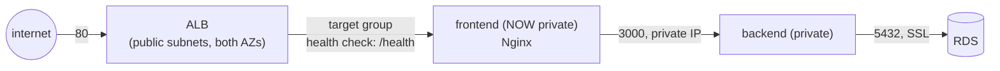

# 09 — Load Balancer and Target Groups

> The frontend goes fully private — the ALB becomes the only public entry
> point in the whole stack. This is the exact Part 5 → Part 6 transition
> `three-tier-deployment` made by hand: one more security-group edit and a
> subnet move, expressed here as a `modules/alb/` and two changed inputs to
> the `ec2` module.

## 1. What changed from lesson 08

| | Lesson 08 | This lesson |
|---|---|---|
| Frontend subnet | public | private-app |
| Frontend public IP | yes | **none** |
| Frontend's 80 rule | `0.0.0.0/0` | the ALB's security group only |
| Public entry point | the frontend's own IP | the ALB's DNS name |



Nothing about the frontend or backend instances' *application* code
changed — only where the frontend lives and what's allowed to reach it.
That's the whole point of building the SG chain and the `ec2` module as
reusable pieces back in lessons 03/07: this transition is a few lines of
Terraform, not a rebuild.

## 2. The ALB module

[`modules/alb/`](modules/alb/) is deliberately minimal for this stage — a
single target (the one frontend instance, via
`aws_lb_target_group_attachment`), not an Auto Scaling Group. Health checks
hit the frontend's own `/health` path, which — same as lesson 08 — is
itself proxied through to the backend, so a healthy target genuinely means
"frontend, backend, and the path between them are all up," not just "Nginx
is running."

```hcl
resource "aws_lb_target_group" "this" {
  port     = var.target_port
  protocol = "HTTP"
  health_check {
    path    = var.health_check_path   # "/health"
    matcher = "200"
  }
}
```

An ALB **requires** subnets in at least 2 AZs — lesson 06's VPC already
provides exactly that (`module.vpc.public_subnet_ids`, one per AZ).

## 3. Run it

```bash
cd 09-load-balancer-target-groups
cp backend.hcl.example backend.hcl
terraform init -backend-config=backend.hcl
terraform apply   # ~7-8 minutes: RDS + NAT Gateway + ALB provisioning
```

Real output (45 resources — lesson 08's 40, plus the ALB, listener, target
group, and attachment):

```console
$ terraform apply -auto-approve
module.alb.aws_lb.this: Creation complete after 2m2s [id=arn:aws:elasticloadbalancing:...]
module.rds.aws_db_instance.this: Creation complete after 4m55s [id=db-DY2EJWQAIQ7MCCFV4EWISHKOTU]
module.frontend.aws_instance.this: Creation complete after 13s [id=i-0368428e100973cfc]
module.alb.aws_lb_target_group_attachment.this: Creation complete after 1s

Apply complete! Resources: 45 added, 0 changed, 0 destroyed.

Outputs:
alb_dns_name = "three-tier-terraform-09-alb-487305298.ap-southeast-1.elb.amazonaws.com"
app_url = "http://three-tier-terraform-09-alb-487305298.ap-southeast-1.elb.amazonaws.com"
```

Confirmed the target actually registers healthy (not just "attached") —
this is where a wrong health-check path or a firewalled port shows up:

```console
$ aws elbv2 describe-target-health --profile ostad \
    --target-group-arn arn:aws:elasticloadbalancing:...:targetgroup/three-tier-terraform-09-tg/... \
    --query 'TargetHealthDescriptions[0].TargetHealth'
{"State": "healthy"}
```

Full end-to-end through the ALB's DNS name — no bugs this run; the
SSL/URL-encoding fixes from lessons 05 and 08 carried straight through:

```console
$ curl http://three-tier-terraform-09-alb-.../health
{"status":"ok"}
$ curl "http://.../api/v1/forecast?latitude=23.81&longitude=90.41&city=Dhaka"
{"latitude":23.796133,...}
$ curl http://.../api/v1/history
{"rows":[{"city":"Dhaka",...,"queried_at":"2026-09-14T04:04:17.074Z"}]}
```

And confirmed the frontend really has no public IP at all — the ALB is not
optional now, it's the only way in:

```console
$ aws ec2 describe-instances --profile ostad --instance-ids i-0368428e100973cfc \
    --query 'Reservations[0].Instances[0].PublicIpAddress' --output text
None
```

### Clean up

```console
$ terraform destroy -auto-approve
Destroy complete! Resources: 45 destroyed.
```

## If it breaks

- Target stuck `unhealthy` — the frontend's security group must allow port
  80 from the **ALB's** security group specifically
  (`security_groups = [aws_security_group.alb.id]`), not a CIDR block; a
  common mistake is leaving a stale `cidr_blocks` rule from lesson 08 and
  forgetting the ALB doesn't have a fixed IP to match against.
- `curl` to the ALB DNS name hangs/times out — DNS for a new ALB can take
  30-60 seconds to propagate after `apply` finishes; retry rather than
  assuming it's broken immediately.
- Grabbing the wrong ARN when checking target health by hand — the
  `aws_lb_target_group_attachment` resource's own Terraform ID is
  `<target-group-arn>-<random-suffix>`, not the target group's ARN itself.
  Use `aws elbv2 describe-target-groups --names <name> --query
  'TargetGroups[0].TargetGroupArn'` to get the real one.

## Next

**[10 — Bastion Host for Secure SSH Access](../10-bastion-host/)**
