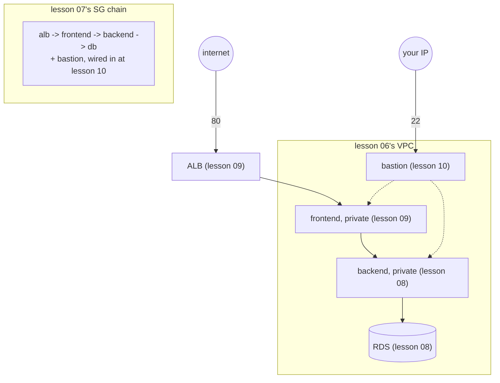

# 11 — Complete Production Deployment (Class 8 capstone)

> Everything from lessons 06-10, assembled in one `terraform apply`: custom
> VPC, the full chained security-group set, RDS, Secrets Manager, a bastion
> with a Terraform-generated key pair, and an ALB as the sole public entry
> point. This is architecturally identical to lesson 10 — the capstone's
> job is the full walkthrough: every resource in state, every output, and
> proof the whole thing tears down to nothing.

## 1. Why this looks like lesson 10

It *is* lesson 10's exact shape, renamed. That's deliberate, not
laziness-in-disguise: Class 8's whole arc (06 → 10) built this architecture
one piece at a time so each piece could be understood — and verified — in
isolation. The capstone's job isn't to add something new, it's to prove the
pieces really do compose into one coherent `terraform apply`, and to walk
through the *operational* side (state, outputs, teardown order) that a
lesson-by-lesson build doesn't emphasize on its own.



## 2. Run it

```bash
cd 11-complete-production-deployment
cp terraform.tfvars.example terraform.tfvars   # fill in my_ip_cidr
cp backend.hcl.example backend.hcl
terraform init -backend-config=backend.hcl
terraform apply   # ~7-8 minutes
```

Real output — 53 resources in one apply:

```console
$ terraform apply -auto-approve
module.rds.aws_db_instance.this: Creation complete after 4m45s [id=db-ZEK5VQUYE6U5JWYZXULV4NW6Z4]
module.backend.aws_instance.this: Creation complete after 13s
module.frontend.aws_instance.this: Creation complete after 13s
module.alb.aws_lb_target_group_attachment.this: Creation complete after 0s

Apply complete! Resources: 53 added, 0 changed, 0 destroyed.
```

## 3. The full state and outputs walkthrough

```console
$ terraform state list
data.archive_file.backend_zip
data.archive_file.frontend_zip
data.aws_caller_identity.current
aws_key_pair.bastion
aws_s3_bucket.artifacts
aws_s3_object.backend
aws_s3_object.frontend
aws_s3_object.migration
local_file.private_key
null_resource.frontend_build
tls_private_key.bastion
module.alb.aws_lb.this
module.alb.aws_lb_listener.http
module.alb.aws_lb_target_group.this
module.alb.aws_lb_target_group_attachment.this
module.app_role.aws_iam_instance_profile.this
module.app_role.aws_iam_role.this
module.app_role.aws_iam_role_policy.s3_read[0]
module.app_role.aws_iam_role_policy.secrets[0]
module.app_role.aws_iam_role_policy_attachment.ssm[0]
module.backend.aws_instance.this
module.bastion.aws_instance.this
module.bastion_role.aws_iam_instance_profile.this
module.bastion_role.aws_iam_role.this
module.bastion_role.aws_iam_role_policy_attachment.ssm[0]
module.db_secret.aws_secretsmanager_secret.this
module.db_secret.aws_secretsmanager_secret_version.this
module.db_secret.random_password.this
module.frontend.aws_instance.this
module.rds.aws_db_instance.this
module.rds.aws_db_subnet_group.this
module.sg.aws_security_group.{alb,backend,bastion,db,frontend}
module.vpc.aws_vpc.this
module.vpc.aws_subnet.{public,private_app,private_db}[0-1]
module.vpc.aws_nat_gateway.this
... (53 total)
```

Every module from lessons 03/06/07 shows up with its own address prefix
(`module.vpc.*`, `module.sg.*`, `module.rds.*`, ...) — this is what "modules
compose" looks like in practice: one `state list`, but still legible by
which lesson's module produced each resource.

```console
$ terraform output
alb_dns_name = "three-tier-terraform-11-alb-1977792591.ap-southeast-1.elb.amazonaws.com"
app_url = "http://three-tier-terraform-11-alb-1977792591.ap-southeast-1.elb.amazonaws.com"
backend_private_ip = "10.0.10.168"
bastion_public_ip = "47.128.14.210"
frontend_private_ip = "10.0.11.221"
ssh_key_file = "./three-tier-terraform-11-bastion.pem"
```

Six outputs — everything needed to *use* this deployment (the app's public
URL, the bastion's IP, the local key file) — with the DB password nowhere
in sight, same as lessons 05/08/09/10 (it stays in Secrets Manager,
referenced by ARN only, per lesson 08's honest discussion of that
approach's real limits).

## 4. Final end-to-end proof

```console
$ curl http://three-tier-terraform-11-alb-.../health
{"status":"ok"}
$ curl "http://.../api/v1/forecast?latitude=23.81&longitude=90.41&city=Dhaka"
{"latitude":23.796133,...}
$ curl http://.../api/v1/history
{"rows":[{"city":"Dhaka",...,"queried_at":"2026-09-14T04:34:56.110Z"}]}
```

## 5. Clean up — including the bootstrap, for the first time

```console
$ terraform destroy -auto-approve
Destroy complete! Resources: 53 destroyed.
```

Re-verified empty against real AWS state, not just trusting Terraform's own
exit code:

```console
$ aws ec2 describe-vpcs --profile ostad --filters "Name=tag:Name,Values=three-tier-terraform-11"
(empty)
$ aws rds describe-db-instances --profile ostad \
    --query "DBInstances[?DBInstanceIdentifier=='three-tier-terraform-11']"
(empty)
```

This is the **last** lesson, so — and only now — the
[`04-remote-state-s3/bootstrap/`](../04-remote-state-s3/bootstrap/) S3
bucket and DynamoDB table finally come down too, per the ordering warning
every earlier lesson repeated:

```console
$ cd ../04-remote-state-s3/bootstrap
$ terraform destroy -auto-approve
aws_dynamodb_table.lock: Destruction complete after 7s
aws_s3_bucket.state: Destruction complete after 1s

Destroy complete! Resources: 5 destroyed.
```

One wrinkle: the state bucket had versioning enabled, and eight lessons'
worth of *emptied* (but not deleted) state-file objects were still sitting
in it — `terraform destroy` on `aws_s3_bucket` refuses to delete a
non-empty bucket (this bootstrap deliberately has no `force_destroy = true`
— it's meant to be hard to accidentally tear down). Emptied it first with
`aws s3api list-object-versions` + `delete-objects` (versioned buckets need
every version *and* delete marker removed, not just a plain `s3 rm`), then
the Terraform destroy above went through cleanly.

Every resource this entire repo ever created — across all 11 lessons and
the bootstrap — is now gone.

## If it breaks

See lessons 08, 09, and 10's own "If it breaks" sections — this lesson's
failure modes are the union of theirs, since it's the same architecture.

## This is the end of Class 8

Both classes are now complete:

- **Class 7** (lessons 01-05): Terraform fundamentals, Copilot-assisted
  authoring, modules, remote state, and a full single-VM three-tier
  deployment.
- **Class 8** (lessons 06-11): the same production-ready, fully-private,
  load-balanced architecture `three-tier-deployment`'s Part 5/6 built by
  hand with AWS CLI scripts — recreated as composable Terraform modules,
  live-verified at every step, and torn down to zero.
